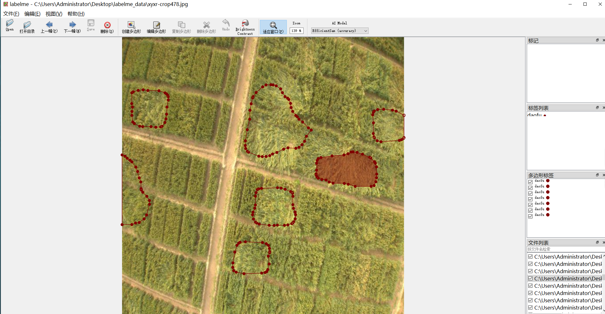
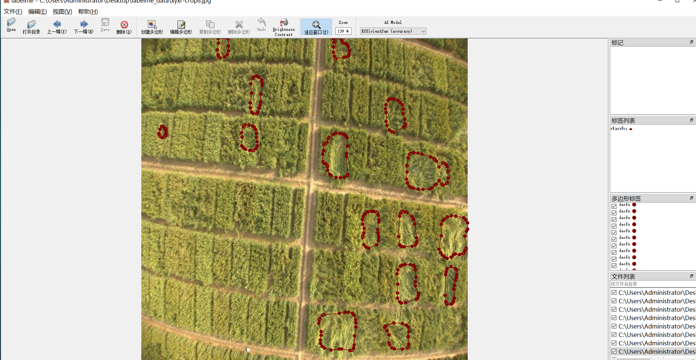
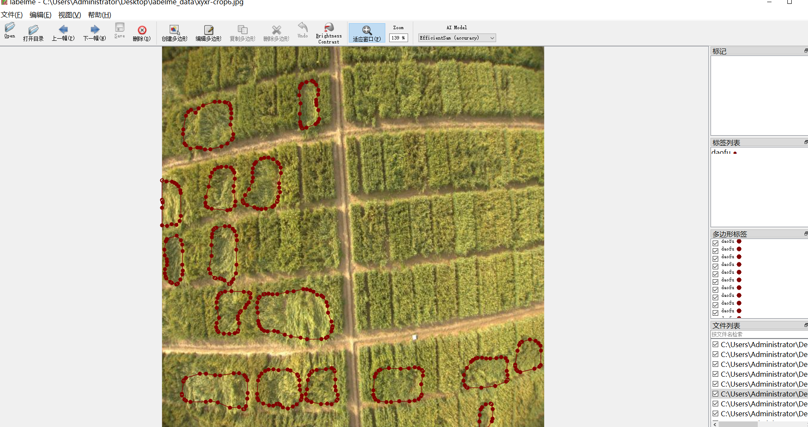
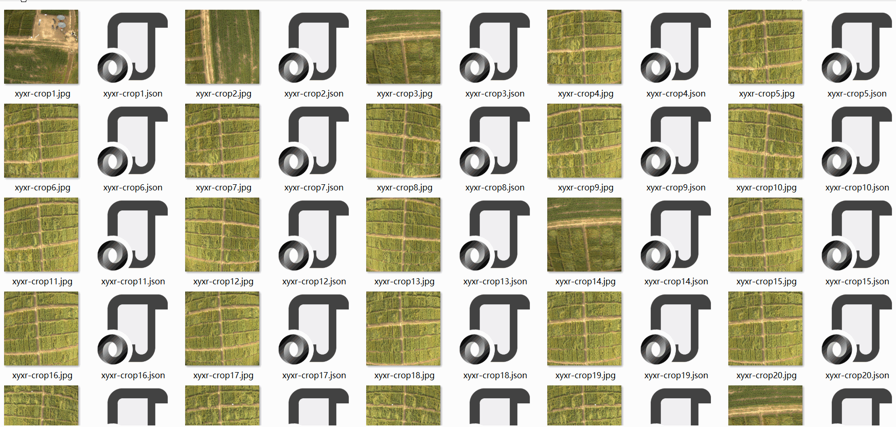

# UAV Aerial Crops Lodging Tips Dataset 1290 images JSON format

The UAV Aerial Crops Lodging Tips Segmentation Dataset contains 1290 images in JSON format.

The dataset is organized as a labelme format (excluding the mask file, only containing JPG images and their corresponding JSON files).

Number of images: 1290

Number of labeled images: 1290

Number of categories: 1

Category names: ["daofu"]

Number of bounding boxes per category:

"daofu count" = 10306

Total number of bounding boxes: 10306

Labeling tools used: labelme=5.5.0

Repository location: firc-dataset

Image resolution: 640x640

Labeling rules: Polygons are drawn around the classes.

Important note: The dataset can be opened and edited using labelme, but the JSON dataset must be converted into either mask or YOLOC format for semantic segmentation or instance segmentation.

Special declaration: This dataset does not guarantee any accuracy for the trained models or weight files.

## Images

---

Here is a pay link on Stripe (https://buy.stripe.com/3cs8yP7sY87d0vu9AB). Please contact me lonlonago@foxmail.com after funding $89, and I will send you a complete data files, thank you!

